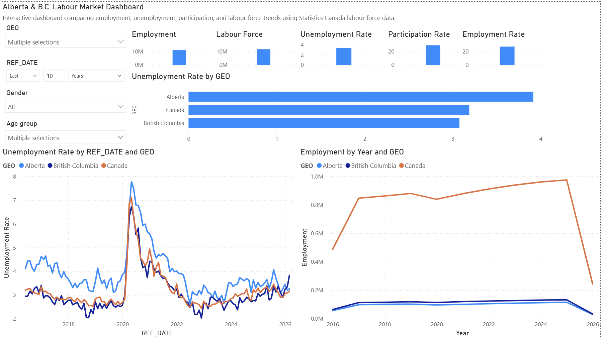
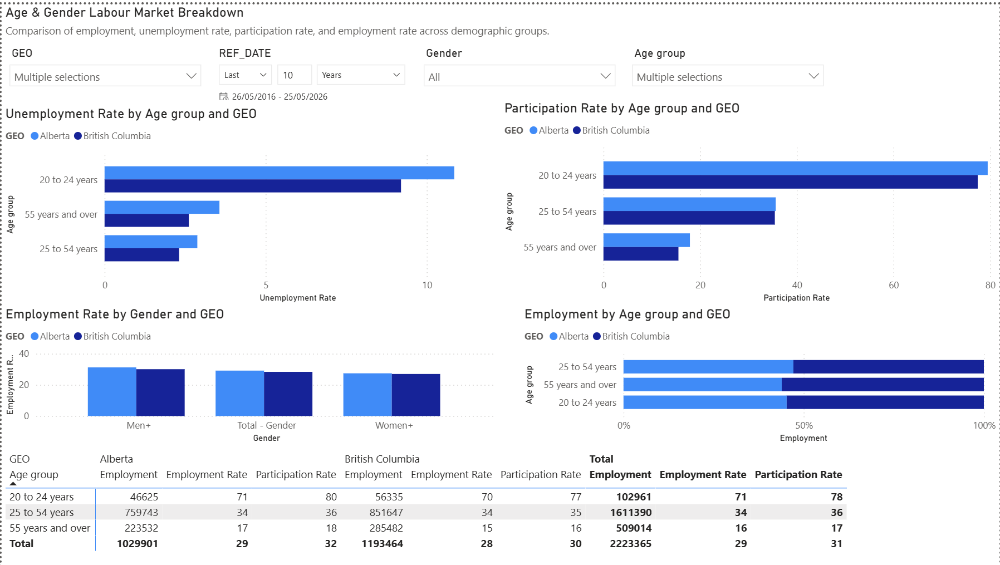

# Data Source

This project uses Statistics Canada labour-force data to analyze employment, unemployment, participation, employment rate, and labour-force trends across Alberta, British Columbia, and Canada.

## Source

Statistics Canada, Table 14-10-0287-03: Labour force characteristics by province, monthly, seasonally adjusted.

The original dataset is not stored in this repository. Data can be downloaded directly from Statistics Canada.

## Data Used

The dashboard focuses on:

- Alberta
- British Columbia
- Canada

Measures analyzed include:

- Employment
- Labour force
- Unemployment rate
- Participation rate
- Employment rate

Demographic dimensions include:

- Sex
- Age group
- Reference date

### Executive Overview

### Age and Gender Breakdown

